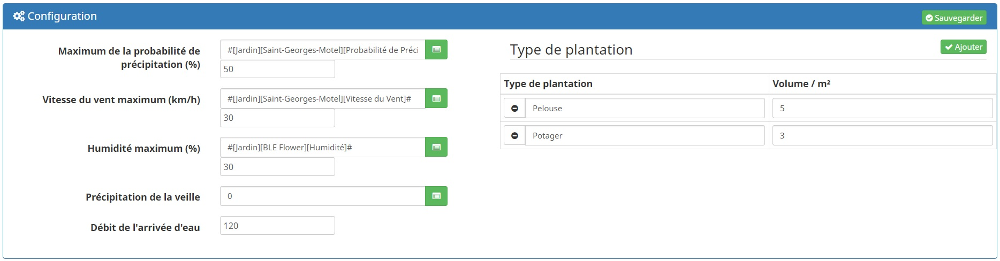
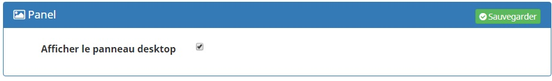
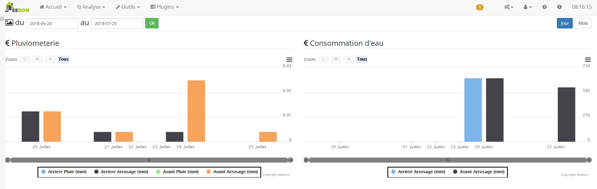

Description
===
Ce plugin a pour objet de gérer facilement et automatiquement votre arrosage automatique.

Une fois configuré :

* le plugin gérera automatiquement l'arrosage selon le type de plantation et le débit de vos turbines ou goutte à goutte.

Configuration
===

Caracterisation de la source d'eau
---

* Temps entre 2 branches arrosages : ceci est un delais (min) qui entre 2 arrosage d'une meme programation
* Débit de l'arrivée d'eau (mm ou L/H) : Debit de votre sources
* Pression maximal de l'arrivée d'eau (bar) : Pression de votre sources

Conditions météorologiques
---
Le plugin est capable de prendre en compte la météo.
Pour chaque parametre il faut selectionné une commande et saisir son seuil

* Maximum de la probabilité de précipitation (%) : interdie l'arrosage si la probablité de précipitation est trop elevé par rapport au seuil
* Vitesse du vent maximum (km/h): interdie l'arrosage si le vent est trop elevé par rapport au seuil
* Humidité maximum (%): interdie l'arrosage si l'humidité est trop elevé par rapport au seuil
* Précipitation de la veille : Le plugin prend en compte les précipitation de la veille

Pluviometerie par type de plantation
---

Le plugin vas distingué le type de plantation, car le besoin en eau n'est pas la meme pour chaque plante
Personnaliser votre liste de type de plantation en y saisissant un nom et la quantité (L/m²) d'eau necéssaire à l'arrosage.

Le débit de la pompe n'est pas encore utilisé, il permettera de déterminer le nombre de zone possible a l'arrosage.

Commandes et widgets
===

Pour chaque zone d'arrosage créée, le plugin va créer les commandes suivantes :

* Activer : Commande pour armer l'arrosage dynamiquement
* Désactiver : Commande pour desarmer l'arrosage dynamiquement
* État activation : Commande pour connaitre l'etat d'armement du plugin
* Réglage coefficient : Commande permetant d'intervenir manuelement sur le temps d'arrosage (de 0% à 100% on reduit le temps au dela on l'augmente)
* Coefficient : Commande pour connaitre la valeur du coéficient

Creation d'une branche / zone d'arrosage
===

Comme pour tous les plugins, nous allons commencer par créer une zone avec le bouton Ajouter. 
Maintenant nous pouvons configurer notre zone d'arrosage.

Configuration générale Jeedom
---

* Nom : le nom a déjà été paramétré mais vous avez la possibilité de le changer,
* Objet parent : ce paramètre permet d'ajouter l'équipement dans un objet Jeedom,
* Catégorie : déclare l'équipement dans une catégorie,
* Visible : permet de rendre l'équipement visible dans le dashboard,
* Activer : permet d'activer l'équipement,
* Type d'arrosage : sélectionner le type de plantation à arroser,
* Pluviométrie d'arrosage : saisir la pluviométrie des turbines ou goutte à goutte.
* Superficie : Saisir la superficie de la zone

Calcul pluviométrie pour un goutte à goutte :

Pluviométrie (mm/h) = (10 000 x débit du goutteur (L/h))/(Espacement latéral (cm) x Espacement des goutteurs (cm))

Conditions
---

Pour chaque zone, nous pouvons choisir des conditions.
Toutes les conditions doivent être respectées pour que les actions soient exécutées.
Pour vous aider à la configuration des conditions, un éditeur est ajouté.

Actions
---

Choisissez les actions à mener sans oublier de configurer leur valeurs et l'étape à laquelle on veut qu'elles s'exécutent.

Programamtion des arrosages
===

La programmation est général, c'est a dire que l'on determine a quel heure on doit arroser pour chaque zone et le plugin se charge du reste.
Si vous decidé d'arroser plusieur zone dans le meme crenaux, mais que la source d'eau n'a pas les ressource (debit / pression) necessaire alors l'arrosage se decalera du temps d'arrosage des premier crenaux avec le temps entre 2 arrosage.

Pour programmer un nouvelle arrosage, il suffit faut se rendre sur la page de configuration des arroseurs puis d'ouvrir la programmation

Pour ajouter a la liste un nouveaux creneaux d'arrosage il suffit de cliquer sur *Ajouter une programmation*
* Selectionner les jours de la programmation
* Selectionner l'heure de la programmation
* Selectionner les zone a arroser pour cette programmation
			
Affichage des staisitques d'arrosage
===

Le plugin a un panel qui vous donne des statistique sur l'arrosage realisé.
Jeedom n'autorise pas par defaut l'affichage d'un panel, il vous sera donc necessaire de l'activé dans un premier temps.

Ensuite rendez vous dans Accueil > Arrosage automatique et vous verrez l'affichage des statistiques de vos arrosages comme ceci 

