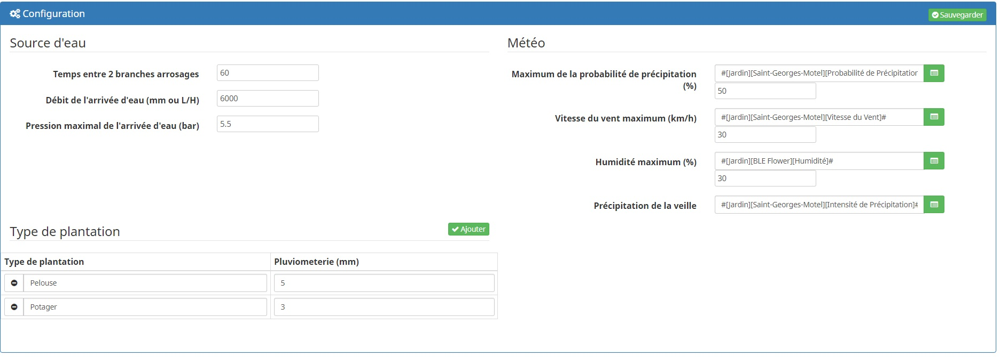

Description
===
Ce plugin a pour objet de gérer facilement et automatiquement votre arrosage automatique.

Une fois configuré :

* le plugin gérera automatiquement l'arrosage selon le type de plantation et le débit de vos turbines ou goutte à goutte.

Configuration
===

Personnaliser votre liste de type de plantation en y saisissant un nom et la quantité (L/m²) d'eau necéssaire à l'arrosage.
Le débit de la pompe est utilisé pour déterminer si on peut lancer 2 zones en même temps ou reporter l'arrosage.

Conditions météorologiques
---

Le plugin interdit l'arrosage si
* le vent est supérieur à 40km/h,
* la probabilité de pluie est supérieure à 30%,
* l'humidité est supérieure à 60%.

Commandes et widgets
---

Pour chaque zone d'arrosage créée, le plugin va créer les commandes suivantes :

* activation de la gestion et
* désactivation de la gestion.

Paramétrage
===

Comme pour tous les plugins, nous allons commencer par créer une zone avec le bouton Ajouter. 
Maintenant nous pouvons configurer notre zone d'arrosage.

Configuration générale Jeedom
---

* Nom : le nom a déjà été paramétré mais vous avez la possibilité de le changer,
* Objet parent : ce paramètre permet d'ajouter l'équipement dans un objet Jeedom,
* Catégorie : déclare l'équipement dans une catégorie,
* Visible : permet de rendre l'équipement visible dans le dashboard,
* Activer : permet d'activer l'équipement,
* Type d'arrosage : sélectionner le type de plantation à arroser,
* Pluviométrie d'arrosage : saisir la pluviométrie des turbines ou goutte à goutte.

Calcul pluviométrie pour un goutte à goutte :

Pluviométrie (mm/h) = (10 000 x débit du goutteur (L/h))/(Espacement latéral (cm) x Espacement des goutteurs (cm))

Programation
---

Nous pouvons pour chaque zone déterminer plusieurs crénaux d'arrosage.
La quantité totale d'arrosage definie sera répartie entre ces zones.

Conditions
---

Pour chaque zone, nous pouvons choisir des conditions.
Toutes les conditions doivent être respectées pour que les actions soient exécutées.
Pour vous aider à la configuration des conditions, un éditeur est ajouté.

Actions
---

Choisissez les actions à mener sans oublier de configurer leur valeurs et l'étape à laquelle on veut qu'elles s'exécutent.
